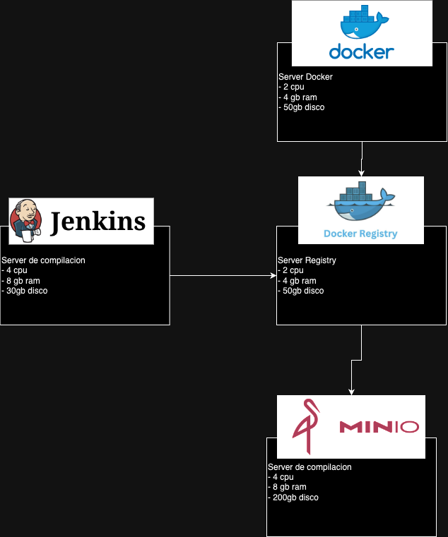

# General
Queremos implementar una arquitectura que nos permita tener las funcionalidades bien definidas. Para eso queremos separar la funcionalidad en distintos servidores.
Lo importante es que estos servidores salvo minio, no van a necesitar tener backups, si falla por algun motivo, la idea es podes regenerar todo con un comando
Los servidores serian los siguientes:
- Host de docker
  - Este va a ser el servidor que va a contener las aplicaciones, es simplemente un host de docker que va a correr las aplicaciones

- Registry
  - En este server se va a guardar las imagenes de docker, estas imagenes son las compilaciones, y esto nos permite que el host despliegue la version especifica si es requerido

- Jenkins / Compilador
  - Este es el server que mas recursos va a necesitar, ya que se encarga de compilar y generar las imagenes para enviarlas al registry

- Minio / S3 / Datos
  - La idea de usar minio es tener un servidor buket que se encargue de guardar imagenes, datos, y mas de las aplicaciones, este server tendria que tener backups, ya que se va a guardar toda la data de los servicios

# Diagrama 



# Instalar Docker
todos los servidores seria lo mejor instalarlos con docker, ya que facilita volver a ejecutar los servicios con un solo comando en caso que falle

[Documentacion Instalación](https://docs.docker.com/engine/install/ubuntu/)

Desinstalar versiones anteriores 
``` sh
for pkg in docker.io docker-doc docker-compose docker-compose-v2 podman-docker containerd runc; do sudo apt-get remove $pkg; done
```
Agregar repositorio APT
``` sh
# Add Docker's official GPG key:
sudo apt-get update
sudo apt-get install ca-certificates curl
sudo install -m 0755 -d /etc/apt/keyrings
sudo curl -fsSL https://download.docker.com/linux/ubuntu/gpg -o /etc/apt/keyrings/docker.asc
sudo chmod a+r /etc/apt/keyrings/docker.asc

# Add the repository to Apt sources:
echo \
  "deb [arch=$(dpkg --print-architecture) signed-by=/etc/apt/keyrings/docker.asc] https://download.docker.com/linux/ubuntu \
  $(. /etc/os-release && echo "$VERSION_CODENAME") stable" | \
  sudo tee /etc/apt/sources.list.d/docker.list > /dev/null
sudo apt-get update
```

Instalar docker 
``` sh
sudo apt-get install docker-ce docker-ce-cli containerd.io docker-buildx-plugin docker-compose-plugin
```

# Prerequisitos Servidores
- Docker compose
- Docker
- Traefik corriendo
``` sh
docker compose -f docker-compose.traefik.yaml up -d
```

# Correr todo localmente
``` sh
docker compose -f docker-compose.traefik.yaml -f registry/docker-compose.registry.yaml -f minio/docker-compose.minio.yaml -f jenkins/docker-compose.jenkins.yaml up -d
```

# Servidor Registry
Se debe ejecutar docker compose de esta forma 
```sh 
docker compose -f registry/docker-compose.registry.yaml up -d
```

# Servidor Minio
Se debe ejecutar docker compose de esta forma 
```sh 
docker compose -f docker-compose.traefik.yaml -f minio/docker-compose.minio.yaml up -d
```

# Servidor Jenkins
Se debe ejecutar docker compose de esta forma 
```sh 
docker compose -f docker-compose.traefik.yaml -f jenkins/docker-compose.jenkins.yaml up -d
```


# al final
tambien queremos instalar una herramienta similar a Open Shift, de momento estamos probando https://coolify.io/docs/installation
esta herramienta puede generar subdominios, generar aplicaciones builds etc, la idea es usarla para que gestione las apps
De momento esta a prueba


